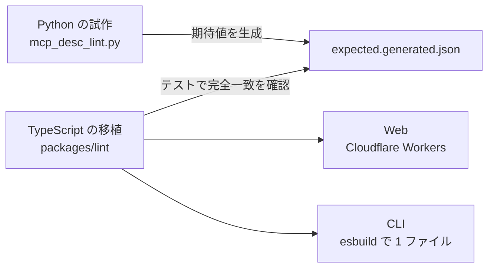

:::message
筆者は、この記事で扱うリンター [Forecall](https://forecall.dev) の開発者です。
:::

## 何を作ったか

AI エージェントは、MCP サーバーのツールを名前、説明文、入力スキーマだけを読んで選びます。Forecall は、その説明文を 100 点満点で採点し、エージェントが取り違えやすいツールの組を見つける静的なリンターです。

最初は Python のスクリプトとして書き、公開されている 8 つの MCP サーバー（126 ツール）を採点しました。


*公開 MCP サーバー 8 つの平均点（100 点満点）*
その結果を Web で誰でも使えるようにするにあたり、採点を **1 点も変えずに** TypeScript へ移植しました。この記事では、その採点の仕組みと、移植で引っかかった Python と JavaScript の違いを紹介します。



## なぜ静的に採点するのか

実際のモデルにツールを選ばせて測れば正確ですが、呼ぶたびにお金と時間がかかり、結果も毎回揺れます。静的な採点なら、無料で、一瞬で、毎回同じ結果になります。CI に入れて「説明文の質が下がったら落とす」こともできます。

代わりに、文の意味までは読めません。正規表現と単語の集合で判定しているので、言い回しが違えば拾えないこともあります。この限界はドキュメントにも明記しています。

## 採点の仕組み

1 ツールを 6 項目で採点し、合計を 100 点とします。

| 項目 | 配点 |
|---|---:|
| 目的（purpose） | 20 |
| いつ使うか（usage context） | 20 |
| 引数（parameters） | 25 |
| 戻り値（return） | 15 |
| 制約と副作用（constraints） | 10 |
| 例（examples） | 10 |

各項目は、説明文に特定の書き方が含まれているかを正規表現で判定し、スキーマの書き方（引数ごとの説明、文字列の型の制約、`annotations` など）と合わせて点数にします。判定に使うパターンの中身は、この記事では省きます。

126 ツールのうち 87 が「いつ使うか」で 0 点でした。

## 取り違えやすい組の見つけ方

サーバー内のツールを総当たりで比べ、説明文と名前がどれだけ似ているかを、単語の重なりから測ります。似すぎている組を「取り違えやすい組」として報告します。

総当たりなので計算量は $O(n^2)$ ですが、採点できるツールは 200 までに制限しているので、比べるのは多くても 19,900 組です。

Notion の公式サーバーでは 57 組が見つかりました。いちばん似ていたのは `API-get-block-children`（「Notion | Retrieve block children」）と `API-retrieve-a-block`（「Notion | Retrieve a block」）で、類似度は 0.88 でした。

## 採点を 1 点も変えない移植

Python の試作が出した結果を「正」とし、TypeScript の結果がすべてのツールで完全に一致することをテストで確かめています。期待値は、試作を実行して JSON に書き出したものです。研究用の 126 ツールに加え、試作の分岐を通すための小さな合成ケースも入れています。CI では Python を動かさず、生成した JSON をコミットしておきます。

一致させるまでに、次の違いを吸収する必要がありました。

### 正規表現の `\b`、`\s`、`.`

Python 3 の `re` は、`\b` と `\s` を Unicode で解釈します。`.` は改行 `\n` だけを除きます。JavaScript の正規表現は、`u` フラグを付けてもこの挙動になりません。

そこで、試作の正規表現を文字列のまま持ち、同じ意味の JavaScript の正規表現に書き換える小さな変換器を作りました。

```ts:packages/lint/py-regex.ts
/** Python's \w: str.isalnum() or "_". */
const WORD = String.raw`\p{L}\p{N}_`;
const BOUNDARY = `(?:(?<=[${WORD}])(?![${WORD}])|(?<![${WORD}])(?=[${WORD}]))`;
```

`\b` は前後読みで、`\s` は Python の `str.isspace()` と同じ文字の集合で置き換えます。対応していない書き方が出てきたら例外を投げるので、パターンを足したときに意味が黙って変わることはありません。

:::details 変換器の本体
```ts:packages/lint/py-regex.ts
export function pyRegex(pattern: string, flags = ""): RegExp {
  let source = "";
  let inClass = false;
  for (let i = 0; i < pattern.length; i++) {
    const char = pattern[i] as string;
    if (char === "\\") {
      const next = pattern[++i] as string;
      if (next === "s") source += inClass ? SPACE : `[${SPACE}]`;
      else if (next === "b" && !inClass) source += BOUNDARY;
      else if (PASS_THROUGH.has(next)) source += `\\${next}`;
      else throw new Error(`unsupported escape \\${next} in ${pattern}`);
    } else if (char === "[" && !inClass) {
      inClass = true;
      source += char;
    } else if (char === "]" && inClass) {
      inClass = false;
      source += char;
    } else if (char === "." && !inClass) {
      source += String.raw`[^\n]`;
    } else {
      source += char;
    }
  }
  return new RegExp(source, `${flags}u`);
}
```
:::

### 丸め方

平均点は小数第 1 位に丸めます。Python の `round` は偶数丸めで、しかも double の正確な 2 進の値で判定します。`round(2.675, 2)` が `2.67` になるのは、2.675 が実際には 2.67499999… として保存されているためです。

`Math.round` では再現できないので、double を仮数と指数に分解し、`BigInt` で正確に計算する `roundHalfEven` を実装しました。

```ts:packages/core/round.ts
// value = mantissa * 2^exponent exactly, with exponent < 0 because value is not an integer.
const { mantissa, exponent } = decompose(Math.abs(value));
const numerator = mantissa * 10n ** BigInt(digits);
const denominator = 1n << BigInt(-exponent);
let quotient = numerator / denominator;
const twiceRemainder = 2n * (numerator - quotient * denominator);
if (twiceRemainder > denominator || (twiceRemainder === denominator && quotient % 2n === 1n)) {
  quotient += 1n;
}
```

### その他の細かい違い

- **JSON の値の真偽**: Python では `[]` や `{}` が偽になります。同じ判定をする `truthy` を用意しました。
- **重複した名前**: 試作は名前をキーにした辞書を使っていたので、同じ名前のツールがあると後のものが勝ちます。`Map` でも同じ挙動にしています。
- **名前の長さ**: Python の `len` はコードポイント数を返します。JavaScript の `length` は UTF-16 の単位なので、`[...name].length` で数えます。

## ReDoS を避ける

試作には、`.*` で語と語の間を任意に飛ばす正規表現がありました。長い説明文では、バックトラックで時間がかかる恐れがあります。Web で誰でも入力できる以上、これは避けたいところです。

そこで、この部分だけを正規表現から外し、行ごとに先頭の語を探してから後ろの語を探す、線形の関数に置き換えました。判定の結果は試作と同じです。

同じ理由で、Python の `str.strip()` にあたる処理も `/\s+$/` ではなくループで書いています。この正規表現は、空白の多い入力でバックトラックが 2 乗に増えるためです。

## 採点規則の版

結果には必ず採点規則の版（`lintVersion`）を残します。パターン、閾値、丸め方など、同じ入力で点数が変わりうる変更をしたら版を上げます。結果を比べられるのは同じ版の間だけです。

サイトに載せている見本の数字（Notion の 33.0 点など）は、テストで研究用のデータを採点し直して確かめています。規則を変えて数字が動けばテストが落ちるので、古い数字が残りません。

## 同じコードを Web と CLI で動かす

採点のパッケージは I/O を持たず、Node.js 固有の API も使いません。そのため、同じコードがそのまま 2 か所で動きます。

- **Web**: Cloudflare Workers の上で動き、貼り付けた `tools/list` を採点します。
- **CLI**: esbuild で 1 つのファイルにまとめ、`npx forecall lint` で手元で採点します。

CLI の `lint` は通信しません。まとめたファイルの `lint` の経路に `fetch(` や `WebSocket` などが含まれないことを、テストで確かめています。中身を誰でも読めるように、最小化もしていません。

```bash
npx forecall lint tools.json --fail-under 60
```

## これから

静的な採点は、説明文に「書いてあるか」しか分かりません。次は、実際のモデルにツールを選ばせ、選び間違いと引数の誤りを測る評価を作っています。

https://forecall.dev
