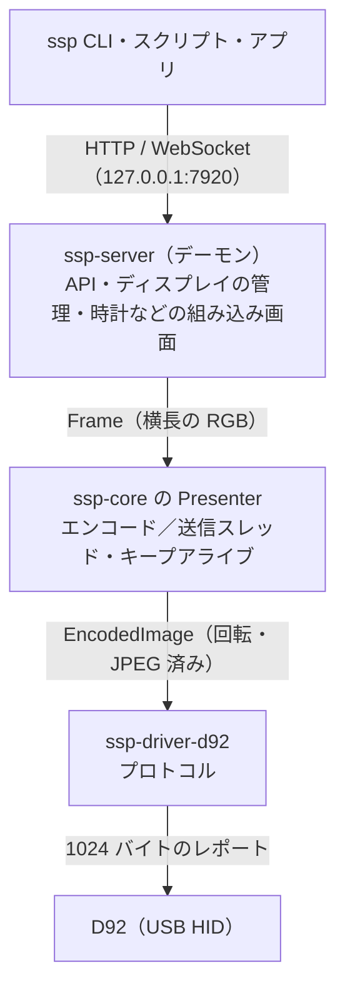

モニターの下に、upHere の 9.2 インチのサブディスプレイ「D92」を置いています。1920x462 の横長なバー型のディスプレイで、時計やシステム情報を表示するためのものです。

このディスプレイを macOS・Linux・Windows のどれからでも動かせるツール「sub-screen-player」を Rust で作って、オープンソースで公開しました。この記事では、D92 を動かすまでに分かったことと、ツールの設計について書きます。

https://subscreen.dev/ja/

https://github.com/nomunomu0504/sub-screen-player


*sub-screen-player が D92 に表示している時計（1920x462）*

:::message
**追記（2026-10-08）**: v0.2.0 で、時刻と CPU・メモリ・ネットワーク・ディスクの使用状況を、直近1分のグラフ付きで並べるダッシュボード（`ssp dashboard`）を追加しました。時計で日本語の日付・曜日も表示できるようになっています。表示のパターンは[サイトのトップ](https://subscreen.dev/ja/)にまとめています。
:::


*v0.2.0 で追加したダッシュボード（`ssp dashboard`）*

:::message
**追記（2026-10-09）**: v0.3 と v0.4 で、表示できるものが増えました。Claude Code の使用量のパネル（今の5時間枠と今日のトークン数。手元のログを読むだけで、外部には何も送りません）、スクリプトから送った数値のパネル（`ssp metric set`）、HTML で作った Web ページ（`ssp web`）、動画と GIF などのアニメーション（`ssp show`）です。v0.4 からは画面の変わった部分だけを送るので、時計なら1フレームあたり約 50 KB が約 3.5 KB になりました。
:::


*v0.3 で追加した Claude Code のパネル（`ssp dashboard --widgets clock,claude-code,cpu,memory`）*

## きっかけ

D92 は HDMI ではなく、専用のアプリから USB 経由で画像を送って表示する仕組みです。ところが、そのアプリ（MiraBox Craft）は Windows 専用で、普段使っている Mac からは何も表示できませんでした。

最初は、見た目の似た TURZX 系のディスプレイだと思い込んでいて、TURZX 向けの OSS を試してみました。ところが通信方式がまったく違っていて、反応しません。D92 を Mac や Linux から動かす方法も探しましたが、見つかりませんでした。

ないなら作るしかない、ということで、まずは D92 の動かし方を調べるところから始めました。調査から実装までは、Claude Code と一緒に進めています。

## D92 の動かし方

### Mac から HID レポートを送ってみる

D92 は USB の HID デバイス（`2100:0006`、usage page `0xFFA0`）として見えます。OS 標準の HID ドライバで扱えるので、macOS でも root 権限やドライバのインストールなしに、hidapi から 1024 バイトの出力レポートを送れます。

MiraBox 系の機器で使われている「`CRT\0\0` + コマンド語」の形式でコマンドを送ってみると、いくつかはすぐに反応しました。

| コマンド | `CRT\0\0` の後のバイト列 | 効果 |
|---|---|---|
| 点灯 | `DIS` | 画面をオン |
| 消灯 | `HAN` | 画面をオフ |
| 明るさ | `LIG` `00 00` `<パーセント>` | バックライト 0〜100 % |

ただ、画像だけがなかなか表示されません。しかも D92 は**何を送っても一切応答を返さない**ので、うまくいかなかったときに、どこが悪いのかが分かりません。

### 画像を表示する

画像は `DRA` というコマンドで、JPEG をそのまま送ります。レイアウトはこうなっています。

```text
レポート1:  43 52 54 00 00 44 52 41  "CRT\0\0DRA"
            [8..12]  u32 ビッグエンディアン: 32 + JPEG の長さ
            [12]     0xB1
            [13..32] ゼロ
            [32..]   ここから JPEG が始まる
レポート2〜: JPEG の続き。プレフィックスなしでそのまま並べ、最後のレポートはゼロ埋め
```

Rust で書くとこれだけです。

```rust:crates/drivers/d92/src/protocol.rs
pub fn live_frame(jpeg: &[u8]) -> Vec<u8> {
    let total = LIVE_HEADER_LEN + jpeg.len();
    let mut out = Vec::with_capacity(total.next_multiple_of(REPORT_LEN));
    out.extend_from_slice(b"CRT\0\0DRA");
    out.extend_from_slice(&(total as u32).to_be_bytes());
    out.push(LIVE_FLAG);
    out.resize(LIVE_HEADER_LEN, 0);
    out.extend_from_slice(jpeg);
    pad_to_reports(&mut out);
    out
}
```

### ハマったところ

応答が返ってこないので、コマンドを送っては画面を見て、反応がなければ抜き差しして、を何度も繰り返しました。分かったことをまとめておきます。

- **サイズは「JPEG の長さ + 32」**: ヘッダーの 32 バイトも含めた長さを書く必要があります。JPEG の長さだけにすると、エラーも出ずに黙って捨てられます。
- **画像は 90 度回して送る**: 本体の座標は縦向きで、横長の絵は時計回りに 90 度回した 462x1920 の JPEG で送ります。最初は左に 90 度回った状態で表示されました。
- **キープアライブが必要**: `CONNECT` を約 8 秒送らないと、本体が自分で再起動します（USB から約 3 秒消えます）。2 秒ごとに送っています。
- **消灯中は何を送っても暗いまま**: `HAN` で消灯した後は、`DRA` でフレームを送り続けても画面は暗いままで、`DIS` で点灯し直します。そこで、消灯中も表示内容は動かし続けておき、点灯したらすぐに最新の画面が出るようにしています。
- **送ってはいけないコマンドがある**: 「拡張スクリーン」モードのコマンド（`CRT\0\0SCREEN\0`）を送ると、どのコマンドも受け付けなくなり、物理的に抜き差しするしかありませんでした。ドライバには、このコマンドを決して送らないことを確かめるテストを入れています。

:::message alert
画像をデバイスに保存する `LOG` コマンドには「モード」のバイトがあり、`0x02` は電源を切っても残る画像、`0x01` は**起動ロゴ**になります。調査中に `0x01` を試した結果、工場出荷時の upHere ロゴは上書きされてしまいました（まだ元に戻せていません）。同じことを試す場合は気をつけてください。
:::

60fps の秘密は `DRA` にあります。保存を伴う `LOG` は 1 枚あたり約 1.5 秒かかりますが、`DRA` はフラッシュに書かないので、Mac からは 30 KB のフレームを約 15 ms で送れます。

プロトコルの詳細は、リポジトリのドキュメントにまとめています。

https://subscreen.dev/ja/devices/d92/

## sub-screen-player の設計

最初は Go で動作確認用のツールを書き、ちゃんと使える形になってきたところで、公開用に Rust で作り直しました。

### 全体の構成

単一バイナリの `ssp` が常駐デーモンになってディスプレイとの接続を保ち、HTTP / WebSocket の API を提供します。`ssp` のほかのサブコマンドは、このデーモンに対する小さな HTTP クライアントです。



クレートは役割ごとに分けていて、依存は `cli` → `server` → `drivers/*` → `core` の下向きだけです。機種固有のバイト列はドライバのクレートの中にしか書きません。

### 最新フレーム優先の Presenter

60fps を出すための中心が、`ssp-core` の `Presenter` です。

- フレームは1枠だけのスロットに入れ、まだ処理されていない前のフレームは捨てます。送信が追いつかなくても遅延がたまらず、常に最新のフレームが表示されます。
- **エンコードスレッド**が回転と JPEG エンコードを行い、**デバイススレッド**が送信します。次のフレームのエンコードが今のフレームの送信と並行して進むので、フレームレートは両者の合計ではなく、遅い方で決まります。
- 画面に出ているものと同じフレームは送りません。
- 明るさや電源などのコマンドとキープアライブも、同じデバイススレッドを順番に通ります。ディスプレイを触るのは常に1つのスレッドだけなので、ドライバ側でロックが要りません。

### ドライバを足せば別の機種にも対応できる

機種ごとの違いは、`Driver` と `Display` という2つのトレイトの実装に閉じ込めています。`Driver` は、どの USB デバイスを担当するかと、その開き方だけを知っています。

```rust:crates/core/src/driver.rs
pub trait Driver: Send + Sync {
    /// Short, stable id used in configs and display ids, e.g. `"d92"`.
    fn id(&self) -> &'static str;

    /// Human-readable name, e.g. `"upHere / MiraBox D92"`.
    fn name(&self) -> &'static str;

    /// USB interfaces this driver handles.
    fn usb_matches(&self) -> &'static [UsbMatch];

    /// Opens a matching interface and prepares the display for use.
    fn open(&self, candidate: &Candidate) -> Result<Box<dyn Display>>;

    /// Whether the driver is still being developed. Experimental drivers are only used when
    /// asked for by id (`--driver <id>` or `[drivers] enable` in the config), so they never
    /// take over a device on their own.
    fn experimental(&self) -> bool {
        false
    }
}
```

`Display` には表示・保存・明るさ・電源・キープアライブなどのメソッドがあり、機種にない操作は既定の実装のままにしておけば「未対応」として扱われます。新しい機種に対応するときに書くのは、プロトコルの部分だけです。

### 安全な初期設定

ディスプレイを操作する API をローカルで公開するので、ブラウザで開いた Web ページから勝手に操作されないようにしています。

- 既定では `127.0.0.1` だけで待ち受けます。ループバック以外で待ち受けるには、トークンの設定が必須です。
- トークンなしのときは、`Host` や `Origin` ヘッダーがループバックでないリクエストを拒否します（CSRF や DNS リバインディング対策）。

## 使い方

macOS・Linux はターミナルで、Windows は PowerShell かコマンドプロンプトで次の1行を実行すると、最新のリリースをダウンロードし、チェックサムを確認してからインストールします。

```sh
curl -fsSL https://subscreen.dev/install.sh | sh              # macOS・Linux
powershell -c "irm https://subscreen.dev/install.ps1 | iex"   # Windows
```

`ssp serve` でデーモンを起動すると時計が表示されます。あとは別のターミナルから操作します。

```sh
ssp devices                      # ディスプレイの一覧
ssp dashboard                    # 時刻と CPU・メモリ・ネットワーク・ディスクを表示
ssp show photo.jpg --fit cover   # 画像を表示
ssp brightness 60                # 明るさを 60% に
ssp off                          # 画面を消す（ssp on でつける）
ssp service install              # ログイン時に自動で起動
```

自作のプログラムからは、画像を POST するだけで表示できます。

```sh
curl --data-binary @photo.png "http://127.0.0.1:7920/api/v1/displays/default/image?fit=cover"
```

WebSocket にフレームを送り続ければ、そのまま動画になります。バイナリメッセージ1つが1フレームです。

:::details Python で WebSocket にフレームを送る例
```python:stream.py
import asyncio, io, websockets
from PIL import Image, ImageDraw

async def main():
    url = "ws://127.0.0.1:7920/api/v1/displays/default/stream"
    async with websockets.connect(url) as ws:
        for n in range(600):
            img = Image.new("RGB", (1920, 462))
            ImageDraw.Draw(img).text((40, 200), f"frame {n}", fill="white")
            buf = io.BytesIO()
            img.save(buf, "JPEG")
            await ws.send(buf.getvalue())
            await asyncio.sleep(1 / 30)

asyncio.run(main())
```
:::

## 動作確認

実機での確認用に、`ssp selftest` というコマンドを用意しました。デーモンを使わずにディスプレイを直接開いて、接続・コマンド・静止画・連続送信（fps）・キープアライブ・電源を順に試し、項目ごとに PASS / WARN / FAIL を出します。

これを使って、次の環境で確認しています。Linux と Windows は、Mac 上の VMware Fusion の VM に D92 を渡して動かしました。

| 環境 | 連続送信 |
|---|---|
| macOS（Apple Silicon） | 52〜55fps |
| Ubuntu 24.04（ARM64、VM） | 約 58fps |
| Windows 11（ARM64、VM） | 17〜51fps（VM の負荷で変わる） |

x86_64 版の Linux / Windows は、GitHub Actions でビルドとテストまでは確認していますが、実機ではまだ試せていません。動かしてみた方は、`ssp selftest` の結果を添えて教えてもらえると助かります。

## おわりに

D92 を持っている方はもちろん、ほかの機種をお持ちの方のドライバの追加も歓迎です。機種の追加方法はドキュメントにまとめています。

https://subscreen.dev/ja/adding-a-device/

ライセンスは MIT / Apache-2.0 です。Issue や PR をお待ちしています。

:::message
sub-screen-player は upHere・MiraBox などのメーカーとは関係のない非公式のツールです。プロトコルは相互運用のために調べたものです。
:::
